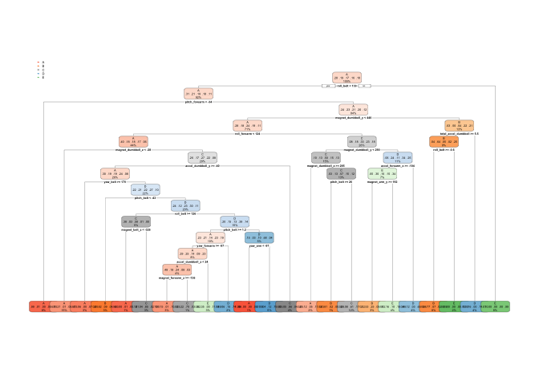

Introduction
------------

Using devices such as Jawbone Up, Nike FuelBand, and Fitbit it is now
possible to collect a large amount of data about personal activity
relatively inexpensively. These type of devices are part of the
quantified self movement – a group of enthusiasts who take measurements
about themselves regularly to improve their health, to find patterns in
their behavior, or because they are tech geeks. One thing that people
regularly do is quantify how much of a particular activity they do, but
they rarely quantify how well they do it. In this project, our goal is
to use data from accelerometers on the belt, forearm, arm, and dumbell
of 6 participants to predict the manner in which they did the exercise
-- the "classe" variable in the training set.

Dataset Description and Exploratory Analysis
--------------------------------------------

### i) About the Dataset

The data for this project come from this source:
<http://groupware.les.inf.puc-rio.br/har>. The dataset we focus on is
the Weight Lifting Exercises Dataset. Six young health participants were
asked to perform one set of 10 repetitions of the Unilateral Dumbbell
Biceps Curl in five different fashions: exactly according to the
specification (Class A), throwing the elbows to the front (Class B),
lifting the dumbbell only halfway (Class C), lowering the dumbbell only
halfway (Class D) and throwing the hips to the front (Class E), with
Class A corresponding to the specified execution of the exercise, while
the other 4 classes corresponding to common mistakes.

The training data for this project are available here:
<https://d396qusza40orc.cloudfront.net/predmachlearn/pml-training.csv>

The test data are available here:
<https://d396qusza40orc.cloudfront.net/predmachlearn/pml-testing.csv>

### ii) Loading and cleaning the data

We load the relevant csv files and look at short summary.

    # Load data
    trainset <- read.csv("pml-training.csv", na.strings = c("NA", "#DIV/0!", ""))
    testset  <- read.csv("pml-testing.csv", na.strings = c("NA", "#DIV/0!", ""))

    # Quick look at data
    str(trainset, list.len=10)

    ## 'data.frame':    19622 obs. of  160 variables:
    ##  $ X                       : int  1 2 3 4 5 6 7 8 9 10 ...
    ##  $ user_name               : Factor w/ 6 levels "adelmo","carlitos",..: 2 2 2 2 2 2 2 2 2 2 ...
    ##  $ raw_timestamp_part_1    : int  1323084231 1323084231 1323084231 1323084232 1323084232 1323084232 1323084232 1323084232 1323084232 1323084232 ...
    ##  $ raw_timestamp_part_2    : int  788290 808298 820366 120339 196328 304277 368296 440390 484323 484434 ...
    ##  $ cvtd_timestamp          : Factor w/ 20 levels "02/12/2011 13:32",..: 9 9 9 9 9 9 9 9 9 9 ...
    ##  $ new_window              : Factor w/ 2 levels "no","yes": 1 1 1 1 1 1 1 1 1 1 ...
    ##  $ num_window              : int  11 11 11 12 12 12 12 12 12 12 ...
    ##  $ roll_belt               : num  1.41 1.41 1.42 1.48 1.48 1.45 1.42 1.42 1.43 1.45 ...
    ##  $ pitch_belt              : num  8.07 8.07 8.07 8.05 8.07 8.06 8.09 8.13 8.16 8.17 ...
    ##  $ yaw_belt                : num  -94.4 -94.4 -94.4 -94.4 -94.4 -94.4 -94.4 -94.4 -94.4 -94.4 ...
    ##   [list output truncated]

We clean the dataset in three ways: 1) remove the first 7 columns given
they contain information (time, user, etc) not relevant to our exercise;
2) remove the variables with near zero variance; 3) remove the columns
in which are mostly NA.

    library(caret)
    dim(trainset); dim(testset)

    ## [1] 19622   160

    ## [1]  20 160

    # 1) Removing first 7 columns
    trainset <- trainset[,-(1:7)]
    testset <- testset[,-(1:7)]
    dim(trainset); dim(testset)

    ## [1] 19622   153

    ## [1]  20 153

    # 2)  Removing variable with near zero varability
    nzv <- nearZeroVar(trainset)
    trainset <- trainset[,-nzv]
    testset <- testset [,-nzv]
    dim(trainset); dim(testset)

    ## [1] 19622   118

    ## [1]  20 118

    # 3)  Removing columns that are mostly NA
    remCol <- sapply(trainset, function(x) mean(is.na(x))) < 0.9
    trainset <- trainset[, remCol==TRUE]
    testset <- testset[, remCol==TRUE]
    dim(trainset); dim(testset)

    ## [1] 19622    53

    ## [1] 20 53

After data cleaning, we end up with 53 covariates and 19622 samples.

### iii) Splitting data for cross validation

For *cross validation* we split the training set into two -- randomly
sample trainset such that 60% is set for training ('training') and 40%
is used for testing ('testing' -- not to be confused with 'testset' for
Course Project Quiz Portion).

    inTrain=createDataPartition(trainset$classe, p=0.6, list=FALSE)
    training <-trainset[inTrain,]
    testing <- trainset[-inTrain,]
    dim(training); dim(testing)

    ## [1] 11776    53

    ## [1] 7846   53

### iii) Exploratory Analysis

We look at the correlations among the variables in the correlation
matrix below. Dark reds show storng positive correlation, and dark blues
show storng negative correlation. We can see that for most of the
variables, correlation is low, and given the already reduced number of
variables, we leave the training set as it is.

    # Note: Wanted to show this, but it made HTML too big to display, so have disabled it.

    #library(ggplot2)
    #library(reshape2)
    #corrDt <- melt(cor(training[-53]))
    #ggplot(data = corrDt, aes(x=Var1, y=Var2, fill=value)) + 
    #        geom_tile()+scale_fill_gradient2(low = "blue", mid="white", high = "red")

Building the prediction model
-----------------------------

### i) Predicting with Trees

Our first model is using trees, where we divide data on splits/nodes
until the groups are sufficiently small.

    library(rpart)
    library(rpart.plot)
    set.seed(123)
    modfit.tree <- rpart(classe ~ ., data=training, method="class")
    rpart.plot(modfit.tree, tweak=1.5)

We now check the performance of this model by using testing for cross
validation:

    set.seed(123)
    pred.tree <- predict(modfit.tree, newdata=testing, type="class")
    confusionMatrix(pred.tree, testing$classe)

    ## Confusion Matrix and Statistics
    ## 
    ##           Reference
    ## Prediction    A    B    C    D    E
    ##          A 2080  331   38  152   96
    ##          B   48  811  119   57   83
    ##          C   41  132 1074  179  157
    ##          D   20  107   96  805   75
    ##          E   43  137   41   93 1031
    ## 
    ## Overall Statistics
    ##                                          
    ##                Accuracy : 0.7394         
    ##                  95% CI : (0.7295, 0.749)
    ##     No Information Rate : 0.2845         
    ##     P-Value [Acc > NIR] : < 2.2e-16      
    ##                                          
    ##                   Kappa : 0.6679         
    ##  Mcnemar's Test P-Value : < 2.2e-16      
    ## 
    ## Statistics by Class:
    ## 
    ##                      Class: A Class: B Class: C Class: D Class: E
    ## Sensitivity            0.9319   0.5343   0.7851   0.6260   0.7150
    ## Specificity            0.8901   0.9515   0.9214   0.9546   0.9510
    ## Pos Pred Value         0.7712   0.7254   0.6785   0.7298   0.7665
    ## Neg Pred Value         0.9705   0.8949   0.9531   0.9287   0.9368
    ## Prevalence             0.2845   0.1935   0.1744   0.1639   0.1838
    ## Detection Rate         0.2651   0.1034   0.1369   0.1026   0.1314
    ## Detection Prevalence   0.3437   0.1425   0.2018   0.1406   0.1714
    ## Balanced Accuracy      0.9110   0.7429   0.8533   0.7903   0.8330

### ii) Predicting with Random Forests

Our next model uses random forest, which 'grows' a large number of trees
(from bootstrapping the variables), and an average is taken across the
trees. Random forests method tend to be highly accurate, and with low
out of sample error.

    library(randomForest)
    set.seed(123)
    modfit.RF <- randomForest(classe ~ ., data=training, ntree=200)
    modfit.RF

    ## 
    ## Call:
    ##  randomForest(formula = classe ~ ., data = training, ntree = 200) 
    ##                Type of random forest: classification
    ##                      Number of trees: 200
    ## No. of variables tried at each split: 7
    ## 
    ##         OOB estimate of  error rate: 0.7%
    ## Confusion matrix:
    ##      A    B    C    D    E  class.error
    ## A 3347    1    0    0    0 0.0002986858
    ## B   14 2254   11    0    0 0.0109697236
    ## C    0   17 2032    5    0 0.0107108082
    ## D    0    0   26 1903    1 0.0139896373
    ## E    0    0    2    5 2158 0.0032332564

We now check the performance of this model by using testing for cross
validation:

    set.seed(123)
    pred.RF <- predict(modfit.RF, newdata=testing)
    confusionMatrix(pred.RF, testing$classe)

    ## Confusion Matrix and Statistics
    ## 
    ##           Reference
    ## Prediction    A    B    C    D    E
    ##          A 2230   10    0    0    0
    ##          B    2 1506   11    0    0
    ##          C    0    2 1354   14    0
    ##          D    0    0    3 1272    3
    ##          E    0    0    0    0 1439
    ## 
    ## Overall Statistics
    ##                                           
    ##                Accuracy : 0.9943          
    ##                  95% CI : (0.9923, 0.9958)
    ##     No Information Rate : 0.2845          
    ##     P-Value [Acc > NIR] : < 2.2e-16       
    ##                                           
    ##                   Kappa : 0.9927          
    ##  Mcnemar's Test P-Value : NA              
    ## 
    ## Statistics by Class:
    ## 
    ##                      Class: A Class: B Class: C Class: D Class: E
    ## Sensitivity            0.9991   0.9921   0.9898   0.9891   0.9979
    ## Specificity            0.9982   0.9979   0.9975   0.9991   1.0000
    ## Pos Pred Value         0.9955   0.9914   0.9883   0.9953   1.0000
    ## Neg Pred Value         0.9996   0.9981   0.9978   0.9979   0.9995
    ## Prevalence             0.2845   0.1935   0.1744   0.1639   0.1838
    ## Detection Rate         0.2842   0.1919   0.1726   0.1621   0.1834
    ## Detection Prevalence   0.2855   0.1936   0.1746   0.1629   0.1834
    ## Balanced Accuracy      0.9987   0.9950   0.9936   0.9941   0.9990

As expected, random forest model is highly accurate, and performs better
than using regression trees.

Conclusions
-----------

Given the random forest model's better accuracy when used on 'tesing'
compared to the prediction model with trees, we'll use modfit.RF for the
Prediction Quiz (on 'testset'.)

Course Project Prediction Quiz Portion
--------------------------------------

We use the random forest model to predict 'classe' for the 20
observations in 'testset', to predict the manner in which participants
did the exercise.

    # For submission:
    pred.quiz <- predict(modfit.RF, newdata=testset)
    pred.quiz

    ##  1  2  3  4  5  6  7  8  9 10 11 12 13 14 15 16 17 18 19 20 
    ##  B  A  B  A  A  E  D  B  A  A  B  C  B  A  E  E  A  B  B  B 
    ## Levels: A B C D E
